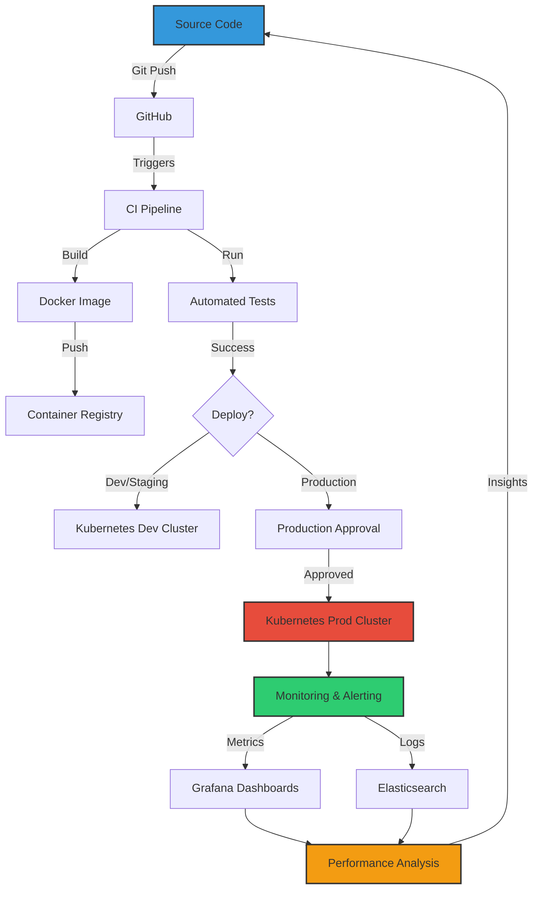

# <div align="center">👨‍💻 Aashish Thakuri</div>

<div align="center">
  <a href="javascript:void(0)">
    
  </a>
</div>

<div align="center">
  
  <a href="javascript:void(0)">
    
  </a>
  
</div>


## 🔥 Spotlight

- 🚀 Building scalable cloud infrastructure with **AWS** & **Azure**
- 🔐 Implementing **zero-trust security** architectures
- 🤖 Developing **CI/CD pipelines** for seamless deployments
- 🌐 **Kubernetes enthusiast** orchestrating containerized applications
- 📊 Passionate about **data-driven architecture** decisions

## 💻 Tech Arsenal

<table>
  <tr>
    <td align="center" width="96">
      <a href="javascript:void(0)">
        
      </a>
      <br>Python
    </td>
    <td align="center" width="96">
      <a href="javascript:void(0)">
        
      </a>
      <br>JavaScript
    </td>
    <td align="center" width="96">
      <a href="javascript:void(0)">
        
      </a>
      <br>AWS
    </td>
    <td align="center" width="96">
      <a href="javascript:void(0)">
        
      </a>
      <br>Docker
    </td>
    <td align="center" width="96">
      <a href="javascript:void(0)">
        
      </a>
      <br>Kubernetes
    </td>
    <td align="center" width="96">
      <a href="javascript:void(0)">
        
      </a>
      <br>GitHub
    </td>
  </tr>
  <tr>
    <td align="center" width="96">
      <a href="javascript:void(0)">
        
      </a>
      <br>React
    </td>
    <td align="center" width="96">
      <a href="javascript:void(0)">
        
      </a>
      <br>REST API
    </td>
    <td align="center" width="96">
      <a href="javascript:void(0)">
        
      </a>
      <br>Nginx
    </td>
    <td align="center" width="96">
      <a href="javascript:void(0)">
        
      </a>
      <br>MySQL
    </td>
    <td align="center" width="96">
      <a href="javascript:void(0)">
        
      </a>
      <br>TypeScript
    </td>
    <td align="center" width="96">
      <a href="javascript:void(0)">
        
      </a>
      <br>C#
    </td>
  </tr>
</table>

## 🌌 Infrastructure as Code

```terraform
module "aashish_skills" {
  source = "github.com/AashishThakuri/terraform-modules"
  
  name  = "aashish-infrastructure"
  
  cloud_providers = {
    aws    = "advanced"
    azure  = "intermediate"
    gcp    = "learning"
  }
  
  containerization = {
    docker     = "advanced"
    kubernetes = "advanced"
    helm       = "intermediate"
  }
  
  ci_cd = {
    github_actions = "advanced"
    jenkins        = "intermediate"
    gitlab_ci      = "intermediate"
    argocd         = "intermediate"
  }
  
  monitoring = {
    prometheus = "advanced"
    grafana    = "advanced"
    elk_stack  = "intermediate"
  }
  
  security = {
    vault          = "intermediate"
    oauth          = "advanced"
    zero_trust     = "intermediate"
    devsecops      = "learning"
  }
}
```

## 📈 GitHub Analytics

<p align="center">
  
</p>

<p align="center">
  
  
</p>

## 🏆 GitHub Trophies

<div align="center">
   <br><br>
</div>

## 🎯 My DevOps Architecture Blueprint



## 🚀 Featured Projects

<div align="center">
  <a href="https://github.com/AashishThakuri/project1">
    
  </a>
  <a href="https://github.com/AashishThakuri/project2">
    
  </a>
</div>

## 🎮 My Coding Workstation

<div align="center">
  <a href="javascript:void(0)">
    
  </a>
</div>

## 🕹️ Interactive GitHub Contribution Animation

<div align="center">
  
</div>

## 📊 Weekly Coding Stats

<!--START_SECTION:waka-->
```text
Terraform    12 hrs 30 mins  ██████████░░░░░░░░░░░░  40.23%
Python       8 hrs 45 mins   ███████░░░░░░░░░░░░░░░  28.16%
YAML         4 hrs 12 mins   ███▒░░░░░░░░░░░░░░░░░░  13.54%
Markdown     2 hrs 5 mins    █▓░░░░░░░░░░░░░░░░░░░░   6.71%
Bash         1 hr 48 mins    █▒░░░░░░░░░░░░░░░░░░░░   5.81%
Other        1 hr 42 mins    █▒░░░░░░░░░░░░░░░░░░░░   5.55%
```
<!--END_SECTION:waka-->

## 🔄 My Service Architecture

<div align="center">
  <a href="javascript:void(0)">
    
  </a>
</div>

## 🛡️ Security Focus Areas

<div align="center">
  
| Security Domain | Tools & Techniques |
|:---------------:|:------------------:|
| **Infrastructure Security** | HashiCorp Vault, AWS KMS, Azure Key Vault |
| **Application Security** | OWASP Testing, SonarQube, Snyk |
| **Container Security** | Trivy, Clair, NeuVector |
| **Compliance** | CIS Benchmarks, SOC2, GDPR |
| **Network Security** | Zero Trust Architecture, mTLS, Service Mesh |
| **IAM** | RBAC, OAuth 2.0, OIDC, JWT |

</div>

## 📫 Connect

<div align="center">
  <a href="https://www.linkedin.com/in/aashishthakuri/" target="_blank">
    
  </a>
  <a href="https://twitter.com/aashishthakuri" target="_blank">
    
  </a>
  <a href="mailto:aashish.thakuri@example.com" target="_blank">
    
  </a>
  <a href="https://aashishthakuri.com.np" target="_blank">
    
  </a>
</div>

<div align="center">
  
</div>


