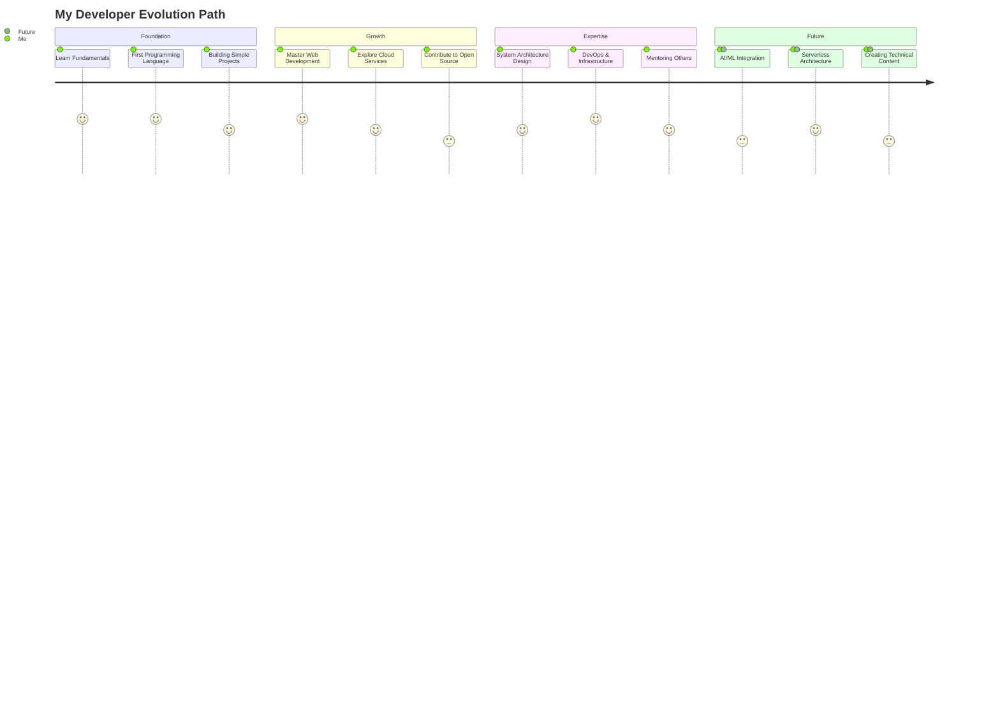

# <div align="center">✨ Aashish Thakuri | Digital Craftsman ✨</div>

<div align="center">
  
</div>

<p align="center">
  
</p>

## ⚡ The Philosophy Behind My Code

> "I believe great software isn't just about solving problems—it's about creating experiences that feel like magic while remaining invisible in their complexity."

I approach every project with three core principles:
- **Elegance** in architecture
- **Empathy** for the end user
- **Excellence** in execution

My journey isn't just about writing code—it's about crafting solutions that make a meaningful difference.

## 💻 Tech Arsenal

<table>
  <tr>
    <td align="center" width="96">
      <a href="javascript:void(0)">
        
      </a>
      <br>Python
    </td>
    <td align="center" width="96">
      <a href="javascript:void(0)">
        
      </a>
      <br>JavaScript
    </td>
    <td align="center" width="96">
      <a href="javascript:void(0)">
        
      </a>
      <br>AWS
    </td>
    <td align="center" width="96">
      <a href="javascript:void(0)">
        
      </a>
      <br>Docker
    </td>
    <td align="center" width="96">
      <a href="javascript:void(0)">
        
      </a>
      <br>Kubernetes
    </td>
    <td align="center" width="96">
      <a href="javascript:void(0)">
        
      </a>
      <br>GitHub
    </td>
  </tr>
  <tr>
    <td align="center" width="96">
      <a href="javascript:void(0)">
        
      </a>
      <br>React
    </td>
    <td align="center" width="96">
      <a href="javascript:void(0)">
        
      </a>
      <br>REST API
    </td>
    <td align="center" width="96">
      <a href="javascript:void(0)">
        
      </a>
      <br>Nginx
    </td>
    <td align="center" width="96">
      <a href="javascript:void(0)">
        
      </a>
      <br>MySQL
    </td>
    <td align="center" width="96">
      <a href="javascript:void(0)">
        
      </a>
      <br>TypeScript
    </td>
    <td align="center" width="96">
      <a href="javascript:void(0)">
        
      </a>
      <br>C#
    </td>
  </tr>
</table>

## 📊 The Developer's Journey Map



## 🌟 The Project Observatory

<div align="center">

<table>
  <tr>
    <td width="50%">
      <h3 align="center">Cloud Native Microservices Platform</h3>
      <div align="center">  
        <a href="https://github.com/AashishThakuri/cloud-native" target="_blank">
          
        </a>
        <br>
        <p>
          <a href="https://github.com/AashishThakuri/cloud-native" target="_blank">
            
          </a>  
          <a href="#" target="_blank">
            
          </a>
        </p>
        <p>A distributed system with <strong>event-driven architecture</strong> using Kubernetes, Kafka, and service mesh.</p>
      </div>
    </td>
    <td width="50%">
      <h3 align="center">AI-Enhanced Developer Workflow</h3>
      <div align="center">  
        <a href="https://github.com/AashishThakuri/dev-ai" target="_blank">
          
        </a>
        <br>
        <p>
          <a href="https://github.com/AashishThakuri/dev-ai" target="_blank">
            
          </a>  
          <a href="#" target="_blank">
            
          </a>
        </p>
        <p>Tools that <strong>amplify developer productivity</strong> using AI-assisted coding and workflow automation.</p>
      </div>
    </td>
  </tr>
</table>
</div>

## 🔮 Code as Creative Expression

<div align="center">
  
</div>

## 🏆 Developer Achievement Tree

```
Leadership in Tech
│
├── Architectural Vision
│   ├── Microservices Design (★★★★★)
│   ├── Event-Driven Systems (★★★★☆)
│   └── Scalable Infrastructure (★★★★★)
│
├── Engineering Excellence  
│   ├── Clean Code Practices (★★★★★)
│   ├── Performance Optimization (★★★★☆)
│   └── Security First Approach (★★★★★)
│
└── Innovation & Growth
    ├── Open Source Contributions (★★★★☆)
    ├── Continuous Learning (★★★★★) 
    └── Mentoring & Knowledge Sharing (★★★★☆)
```

## 🕹️ Interactive GitHub Contribution Animation

<div align="center">
  
</div>

## 🧠 Knowledge Garden

<div align="center">
  <a href="javascript:void(0)">
    
  </a>
</div>

## 📈 Impact Visualization

<div align="center">
  
  
</div>

## 💫 Dimensional Thinking Process

<div align="center">
  
```stl
solid ProblemSolving
  facet normal 0.5 0.5 1.0
    outer loop
      vertex 0.0 0.0 0.0 # Identify Problem
      vertex 1.0 0.0 0.0 # Analyze Context
      vertex 0.0 1.0 0.0 # Define Requirements
    endloop
  endfacet
  facet normal -0.5 0.5 1.0
    outer loop
      vertex 1.0 0.0 0.0 # Analyze Context
      vertex 1.0 1.0 0.0 # Research Solutions
      vertex 0.0 1.0 0.0 # Define Requirements
    endloop
  endfacet
  facet normal 0.0 0.0 1.0
    outer loop
      vertex 0.0 1.0 0.0 # Define Requirements
      vertex 1.0 1.0 0.0 # Research Solutions
      vertex 0.5 0.5 1.0 # Implementation Strategy
    endloop
  endfacet
  facet normal 0.0 0.0 1.0
    outer loop
      vertex 0.5 0.5 1.0 # Implementation Strategy
      vertex 1.0 1.0 0.0 # Research Solutions
      vertex 1.0 0.0 1.0 # Testing Approach
    endloop
  endfacet
  facet normal 0.0 0.0 1.0
    outer loop
      vertex 0.5 0.5 1.0 # Implementation Strategy
      vertex 1.0 0.0 1.0 # Testing Approach
      vertex 0.0 0.0 1.0 # Deployment Plan
    endloop
  endfacet
  facet normal 0.0 0.0 1.0
    outer loop
      vertex 0.0 0.0 1.0 # Deployment Plan
      vertex 0.0 0.0 0.0 # Identify Problem
      vertex 0.5 0.5 1.0 # Implementation Strategy
    endloop
  endfacet
endsolid
```

</div>

## 🌱 Core Development Pillars

<table>
  <tr>
    <td>
      <div align="center">
        
        <h3>Scalability</h3>
        <p>Building systems that grow with needs, not against them</p>
      </div>
    </td>
    <td>
      <div align="center">
        
        <h3>Security</h3>
        <p>Protecting digital assets as a fundamental, not an afterthought</p>
      </div>
    </td>
    <td>
      <div align="center">
        
        <h3>Simplicity</h3>
        <p>Finding elegant solutions to complex problems</p>
      </div>
    </td>
  </tr>
</table>

## 🔥 Inspirational Code Snippets

<details>
  <summary>Elegant Async/Await Pattern</summary>
  
```javascript
// Transform callback hell into elegant async flows
const fetchUserData = async (userId) => {
  try {
    const user = await getUserById(userId);
    const [permissions, preferences] = await Promise.all([
      getPermissions(user.id),
      getPreferences(user.id)
    ]);
    
    return {
      ...user,
      capabilities: permissions.map(p => p.capability),
      settings: preferences.settings
    };
  } catch (error) {
    logger.error(`Failed to fetch complete user data: ${error.message}`);
    throw new EnhancedError('User data retrieval failed', { 
      originalError: error,
      userId,
      context: 'fetchUserData'
    });
  }
};
```
</details>

<details>
  <summary>Functional Programming Paradigm</summary>
  
```python
# Express complex operations as elegant transformations
def process_transactions(transactions):
    """Process financial transactions with a functional approach."""
    return (transactions
            # Extract only completed transactions
            .pipe(lambda df: df[df['status'] == 'completed'])
            # Calculate fee adjusted amounts
            .assign(net_amount=lambda df: df['amount'] - df['fee'])
            # Group by category and calculate statistics
            .groupby('category')
            .agg({
                'net_amount': ['sum', 'mean', 'count'],
                'timestamp': ['min', 'max']
            })
            # Flatten the multi-level columns
            .pipe(lambda df: df.set_axis([f'{col[0]}_{col[1]}' 
                                         for col in df.columns], axis=1))
            # Add derived insights
            .assign(
                duration_days=lambda df: (df['timestamp_max'] - df['timestamp_min']).dt.days,
                average_daily=lambda df: df['net_amount_sum'] / df['duration_days']
            ))
```
</details>

## 📚 Software Development Wisdom Collection

> "Before writing code, I write out the problem. Before architecting a system, I map out the journey. The clearer the vision, the cleaner the execution."

> "Every line of code should exist for a reason. Every component should serve a purpose. Excellence is found not in complexity but in justified simplicity."

> "The best systems are those that can be understood in isolation yet integrate flawlessly with a greater whole. That's the software architect's paradox."

> "Security isn't a layer you add—it's a mindset you adopt from the very first line of code to the very last deployment step."

## 🌐 Connection Points

<div align="center">
  <a href="https://linkedin.com/in/aashishthakuri">
    
  </a>
  <a href="https://twitter.com/aashishthakuri">
    
  </a>
  <a href="https://aashishthakuri.com.np">
    
  </a>
  <a href="mailto:contact@aashishthakuri.com.np">
    
  </a>
</div>

<div align="center">
  
</div>
